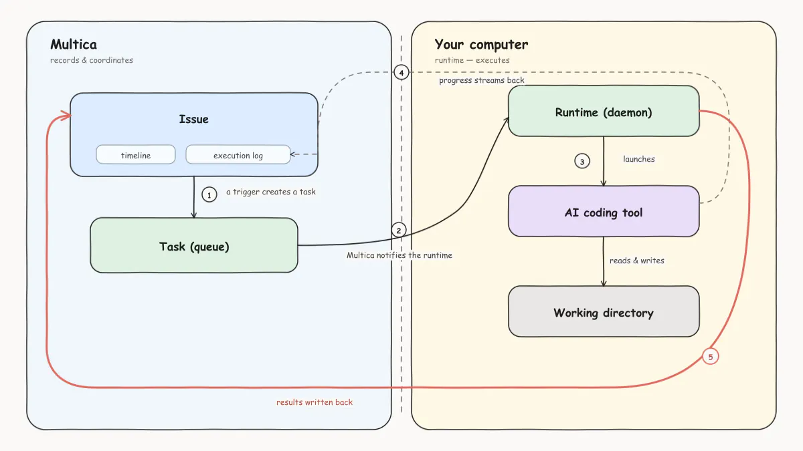

<div align="center">


# Orvilo

**Issue in. Pull request out. On hardware you own.**

[](https://github.com/alexj11324/Cordy/actions/workflows/ci.yml)
[](https://github.com/alexj11324/Cordy/releases)
[](https://github.com/alexj11324/Cordy/stargazers)
[](https://discord.gg/W8gYBn226t)

[Web App](https://patchbay.aspectlylabs.com) · [Docs](https://patchbay.aspectlylabs.com/docs) · [Quickstart](https://patchbay.aspectlylabs.com/docs/cloud-quickstart) · [Download](https://github.com/alexj11324/Cordy/releases/latest) · [Self-Hosting](SELF_HOSTING.md) · [Discord](https://discord.gg/W8gYBn226t) · [X](https://x.com/OrviloAI)

**English | [简体中文](README.zh.md)**

</div>

---

Orvilo is an open-source issue tracker whose executors can be AI coding agents. You file an
issue, set an agent as its executor, and a daemon on a machine you control claims the work,
runs a local coding CLI against your checkout, and writes the result back to the issue.

The coordination lives on the server. The code and the credentials never leave your machine.

## How a run actually works

Nothing starts on its own. Every run traces back to an explicit trigger: you set an issue's
executor, @-mention an agent in a comment, send it a chat message, or an automation fires.

<p align="center">
  
</p>

1. **The issue carries the context** — description, discussion, and three independent roles:
   owner, executor, reviewer.
2. **The server creates a task** and queues it. No runtime online? It waits.
3. **A daemon claims it** over a WebSocket, on whichever machine you connected.
4. **A coding CLI does the work locally** — reading your working directory, running your
   commands, with your tools and your credentials.
5. **Results land back on the issue** — progress comments, the full execution log, token cost.

A finished run is not a finished issue. The run ended; whether the work is done is still your
call, and the issue stays open for more discussion or another pass.

### Where the line sits

| The server holds | Your machine holds |
| --- | --- |
| Workspaces, issues, comments, statuses | The coding CLIs and their credentials |
| Agent configuration and skills | Your repositories and local files |
| Task records, run history, token usage | Every file write and command execution |

Identical on Orvilo Cloud and self-hosted. The one leak to know about: anything you put in an
agent's `custom_env` is stored server-side and shipped to the runtime at execution time — so
don't put secrets there that must never leave the machine.

## What's in the box

**Work tracking that agents are native to.** Issues with owner/executor/reviewer as separate
roles, [projects](https://patchbay.aspectlylabs.com/docs/projects) that bind the repos and
docs a run needs, and [review gates](https://patchbay.aspectlylabs.com/docs/issues) so output
lands in review rather than in `main`.

**Agents as configuration, not processes.** An
[agent](https://patchbay.aspectlylabs.com/docs/agents) is a name, instructions, a model, a set
of [skills](https://patchbay.aspectlylabs.com/docs/skills), an access scope, and a runtime —
idle until triggered. Group them into [teams](https://patchbay.aspectlylabs.com/docs/teams)
with an agent leader that routes work to the rest.

**Four ways to start work.** Set an executor, @-mention, open a
[chat](https://patchbay.aspectlylabs.com/docs/chat), or schedule an
[automation](https://patchbay.aspectlylabs.com/docs/automations) on cron or an external event.

**Receipts for everything.** The [execution log](https://patchbay.aspectlylabs.com/docs/tasks)
replays every tool call, command, and error with timestamps; token usage is broken out per run
and per agent; failures [retry or stop and say why](https://patchbay.aspectlylabs.com/docs/tasks#failures-and-automatic-retries).

**Your infrastructure, end to end.** [Self-host](SELF_HOSTING.md) via Docker Compose or Helm,
point it at [GitHub, GitLab, Gitea, or Forgejo](https://patchbay.aspectlylabs.com/docs/vcs-integration)
including self-hosted instances, and split teams across
[workspaces](https://patchbay.aspectlylabs.com/docs/workspaces) with `owner`/`admin`/`member`
[roles](https://patchbay.aspectlylabs.com/docs/members-roles).

**Where your team already is.** [Slack and Lark](https://patchbay.aspectlylabs.com/docs/channels)
are first-party; DingTalk, WeCom, and Telegram are
[community-maintained](https://patchbay.aspectlylabs.com/docs/community-maintained). Web,
macOS, Windows, and Linux clients share one workspace; the
[iOS app](apps/mobile/README.md) builds from source today and is not on the App Store yet.
Every surface is scriptable through the [CLI and API](https://patchbay.aspectlylabs.com/docs/cli).

## Read this before you point it at your laptop

Orvilo runs agents unattended, which means approval prompts get answered automatically and the
coding tool's own sandbox is off on the default path. **A task runs with the full permissions
of the OS user running the daemon** — it can read that user's SSH keys, edit their shell
profile, and reach the network without restriction.

This is deliberate: agents are asked to install dependencies, run builds, and drive `gh`,
`aws`, and `kubectl` the way you do, and a partial sandbox breaks that work while still not
stopping a task from reading credentials and posting them somewhere. So Orvilo doesn't pretend
to be the boundary — **you put one around it**, in increasing order of strength:

1. A dedicated Unix user that owns only the repos and credentials agents need.
2. A container with only the mounts and secrets that run requires.
3. A VM, when you want the real thing.

What Orvilo *does* isolate is blast radius, not escape: per-task working directories, per-task
agent state so runs don't pollute your `~/.codex/`, and task-scoped API tokens that can't act
as you or as another agent. Full detail, including the one Windows exception:
[Security model](https://patchbay.aspectlylabs.com/docs/security-model).

## Get started

The fastest path needs no terminal — sign in to the
[web app](https://patchbay.aspectlylabs.com), or install
[Orvilo Desktop](https://github.com/alexj11324/Cordy/releases/latest), which registers the
computer it runs on as a runtime and detects the coding CLIs already installed there.

One prerequisite, wherever you run it: the machine doing the work needs at least one
[supported CLI](#supported-agent-clis) installed and signed in. Orvilo drives those tools; it
does not ship them, and it does not ship a model.

Then, in four steps: **connect a computer** (Runtimes → *Add a computer*, paste the two
commands it gives you), **create an agent** (Agents → *New agent*, or let *Build with AI*
write the config from a description), **file an issue**, and **set that agent as its
executor**. Full walkthrough in the
[Quickstart](https://patchbay.aspectlylabs.com/docs/cloud-quickstart) and
[Tutorial](https://patchbay.aspectlylabs.com/docs/tutorial).

<details>
<summary><b>Self-hosting the whole stack</b></summary>

<br/>

```bash
curl -fsSL https://raw.githubusercontent.com/alexj11324/Cordy/main/scripts/install.sh | bash -s -- --with-server
patchbay setup self-host
```

Windows: set `$env:ORVILO_MODE="with-server"`, then
`irm https://raw.githubusercontent.com/alexj11324/Cordy/main/scripts/install.ps1 | iex`.

Pulls official images from GHCR; requires Docker. See the
[Self-Hosting Guide](SELF_HOSTING.md) — and if the GHCR tag you want isn't published yet, fall
back to `make selfhost-build` from a checkout.

</details>

## Supported agent CLIs

Orvilo drives the tools you already have installed and authenticated, so changing provider is a
dropdown rather than a migration.

| Provider | CLI | Provider | CLI |
| --- | --- | --- | --- |
| Claude Code | `claude` | OpenAI Codex | `codex` |
| Cursor Agent | `cursor-agent` | GitHub Copilot CLI | `copilot` |
| OpenCode | `opencode` | Antigravity | `agy` |
| Kimi | `kimi` | Qwen Code | `qwen` |

Plus 18 more — Grok, Trae, Kiro, CodeBuddy, DeepSeek Harness, MiniMax Code, Qoder, and others —
for 26 in total. Full list and setup:
[Install an agent runtime](https://patchbay.aspectlylabs.com/docs/install-agent-runtime) ·
[Providers](https://patchbay.aspectlylabs.com/docs/providers)

## Architecture

```
        Web  ·  Desktop (macOS/Windows/Linux)  ·  iOS
                          │
                          ▼
   ┌──────────────┐   ┌──────────────┐   ┌──────────────────┐
   │   Next.js    │──>│  Go backend  │──>│   PostgreSQL     │
   │   frontend   │<──│  (Chi + WS)  │<──│   (17)           │
   └──────────────┘   └──────┬───────┘   └──────────────────┘
                             │  tasks over WebSocket
                      ┌──────┴───────┐
                      │ Agent daemon │  your machine, next to your code
                      └──────┬───────┘
                             │  spawns
                      ┌──────┴───────────────────────────────┐
                      │  Claude Code · Codex · Cursor · …     │
                      │  (any of the 26 CLIs above)           │
                      └───────────────────────────────────────┘
```

| Layer | Stack |
| --- | --- |
| Web | Next.js 16 (App Router) |
| Desktop | Electron, sharing the web UI packages |
| Mobile | Expo / React Native (iOS) |
| Backend | Go (Chi router, sqlc, gorilla/websocket) |
| Database | PostgreSQL 17 (`pgcrypto` + `pg_trgm`) |
| Agent runtime | Local daemon executing any of the 26 CLIs above |

## Development

Start with the [Contributing Guide](CONTRIBUTING.md).

**Prerequisites:** [Node.js](https://nodejs.org/) 22, [pnpm](https://pnpm.io/) 10.28.2,
[Go](https://go.dev/) 1.26.6, [Docker](https://www.docker.com/)

```bash
make up C=desktop   # backend + the Electron app, already signed in
make seed-dev       # optional: sample issues in the dev-fixtures workspace
```

**Changes are verified in the desktop app, not the browser.** `make up C=desktop` starts
Electron against this checkout's backend and signs it in, so that's where you look at what you
built. Add `make up C=api,web` (plus `make dev-login` for a signed-in browser) when the change
is web-only platform wiring.

`make up` allocates this checkout's own ports and database, so several checkouts and worktrees
run side by side: `make status` proves what's running is yours, `make down` stops it,
`make destroy` deletes it. Prefer one foreground terminal with Ctrl-C to stop? `make dev`
bootstraps the checkout, starts the backend, and opens Electron — it does not start the web app.

We ship most weekdays, so `main` moves fast. Pull often.

### Which document do I want?

| I want to… | Read |
| --- | --- |
| Get an agent doing something today | [Quickstart](https://patchbay.aspectlylabs.com/docs/cloud-quickstart) · [Tutorial](https://patchbay.aspectlylabs.com/docs/tutorial) |
| Understand how the pieces fit | [Core concepts](https://patchbay.aspectlylabs.com/docs/concepts) |
| Contribute code | [CONTRIBUTING.md](CONTRIBUTING.md) — environments, workflow, testing, troubleshooting |
| Run it on my own infrastructure | [SELF_HOSTING.md](SELF_HOSTING.md), then [SELF_HOSTING_ADVANCED.md](SELF_HOSTING_ADVANCED.md) and [SELF_HOSTING_AI.md](SELF_HOSTING_AI.md) |
| Install and drive the CLI or daemon | [CLI_INSTALL.md](CLI_INSTALL.md), then [CLI_AND_DAEMON.md](CLI_AND_DAEMON.md) |
| Connect Git hosts and chat tools | [GitHub](https://patchbay.aspectlylabs.com/docs/github-integration) · [Self-hosted Git](https://patchbay.aspectlylabs.com/docs/vcs-integration) · [Channels](https://patchbay.aspectlylabs.com/docs/channels) |
| Work out why an agent is stuck | [Tasks](https://patchbay.aspectlylabs.com/docs/tasks) · [Troubleshooting](https://patchbay.aspectlylabs.com/docs/troubleshooting) |
| Have an AI agent work in this repo | [AGENTS.md](AGENTS.md), then [CLAUDE.md](CLAUDE.md) |
| Cut a release | [.github/RELEASING.md](.github/RELEASING.md) |

## License

[Orvilo License](LICENSE) — the complete Apache License 2.0 text plus additional conditions
covering hosted services, commercial embedding, and branding. Self-host it, modify it, build on
it; the exact terms are in [LICENSE](LICENSE), attribution notices in [NOTICE](NOTICE).
